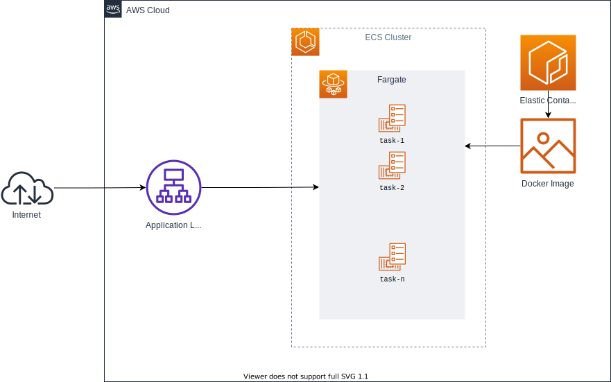

# Terraform/AWS Docker Deploy to Fargate

This repository holds simple boilerplate code to deploy a basic Typescript API application within a Fargate-managed ECS cluster.
This repository also leverages GitHub Actions to lay the CI/CD groundwork to automatically deploy application changes to ECR and redeploy the ECS cluster with updates.

## Installation

### Application

The Typescript application code lives in the [`app/`](app/) subdirectory. This application is built using `node` v14.

```bash
cd app/
npm install
```

### Infrastructure

The required `terraform` version for this repository is v1.0.2. The architecture built from this code is below.



## Usage

This repository is meant to be managed through GitHub Action as the main CI/CD pipeline.

The initial bootstrapping should be done by running the [bootstrap](.github/workflows/bootstrap.yml) workflow. This will initialize the ECR registry, push the initial Docker image, and then apply the remaining infrastructure, deploying the Docker image to ECS.

Subsequent changes can be applied by running the [push_to_ecr](.github/workflows/push_to_ecr.yml) workflow.
